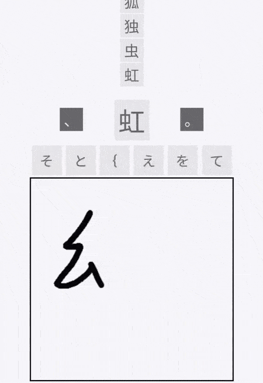
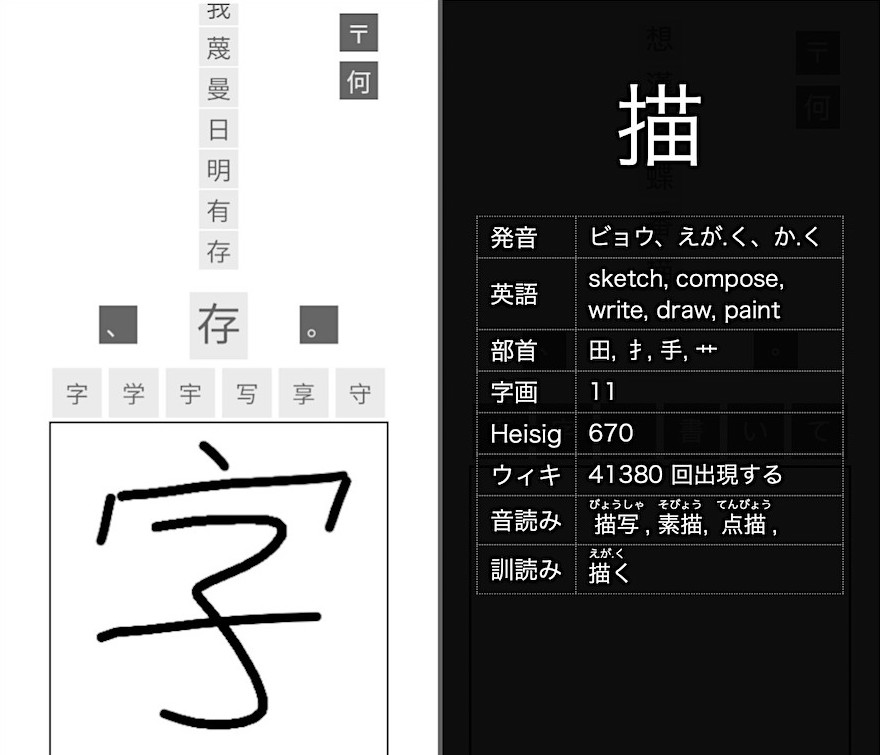

# 連想漢字蝶番　Rensou Kanji Hinge 
###  Try Rensou Kanji Hinge [HERE](https://callumbeaney.github.io/rensou-kanji-hinge/)
### Try a Flutter rebuild with Chinese language functionality [HERE](https://github.com/CallumBeaney/kanji-hanzi-chainer)  
  
   
</img>
  
# 情報と使用法・ABOUT & USAGE 
  
漢字の部首を連想することで漢字の手習いの為の携帯サイトです。描きながら、直上の六つの四角に自動手書き認識ソフトは描いた漢字を推測します。選びが成功すれば、成功欄に追加されます。部首を共有する漢字を思い出せない場合｢、｣と｢。｣ボタンを押すと新しい列を始めます。ある漢字の情報が欲しければその漢字を押してください。

This is a smartphone-oriented web app for practicing hand-writing kanji by chaining them by their shared components, based on how I used to furtively practice kanji on a notepad when I worked in a restaurant:

###  
 虫 虹 工 紅。寸 吋 囗 吐 土。暑、寒、暖。  

   
Write a kanji in the white box. Tap your kanji when it appears in one of the grey boxes to add it to the list. Tap the **、** or **。** buttons to start a new sequence. Tap **〒** to export. If you want to know more about a kanji, tap on it. Functionality for working on a computer is included: write in the canvas, and then press the **送信** button.

 </img>

 

# 辞書情報・DICTIONARY INFORMATION
The dictionary used in this program ("KanjiDictionaryJSO.js") was built from the Compiled Kanji Reference Dictionary spreadsheet in the Dictionaries folder. There is also a JSON version.

I provide all of them for ease of use by others.  
  
**Things to note for those wishing to use these dictionaries:**
- The KANJIDIC index number** is essential for maintaining order when referencing the CKRD and when cross-referencing other dictionaries using the EDRGD KANJIDIC index.
- Some entries in KanjiDictionaryJSO.js and its minified version have been altered & cleaned up, whereas the CKRD and JSON versions have not.
- Dictionary entries in the JS & JSON dictionaries have been ordered by the "wiki" variable in each key:value pair -- that is, 年 is #1 because it has the most (2082013) appearances on the Japanese Wikipedia.

 

**KanjiDictionaryJSO Key:**

| variable | kanji | purpose |
|--|--|--|
bushu | 部首 | radicals
eigo | 英語 | english meaning
jikaku | 字画 | stroke count
heisig | ・・ | Heisig's index number
kanjidicBan | ・・ | The "KANJIDIC" dictionary index number **
yomikata | 読み方 | The entry kanji's pronunciations.
onyomiKanji | 音読み漢字 | Words using the kanji's onyomi, in kanji form
onyomiKana | 音読み仮名 | Words using the kanji's onyomi, in kana form
kunyomiKanji | 訓読み漢字 | Words using the kanji's kunyomi, in kanji form
kunyomiKana | 訓読み仮名 | Words using the kanji's kunyomi, in kana form

 

# ACKNOWLEDGMENTS
The Compiled Kanji Reference Dictionary is built from: 
- EDRDG's [KANJIDIC](http://www.edrdg.org/wiki/index.php/KANJIDIC_Project).
- Michael Raine & Jim Breen's [KRADFILE](http://www.edrdg.org/krad/kradinf.html).
- Shang's *[Kanji Frequency on Wikipedia](https://docs.google.com/spreadsheets/d/18uV916nNLcGE7FqjWH4SJSxlvuT8mM4J865u0WvqlHU/edit?usp=sharing)* spreadsheet. 

The canvas API is Chen-Yu Ho's [Handwriting.JS](https://www.chenyuho.com/project/handwritingjs/).  
The CSS/HTML-only furigana functionality was written by Stack Overflow user [MysticWhiteDragon](https://stackoverflow.com/a/54324347).
